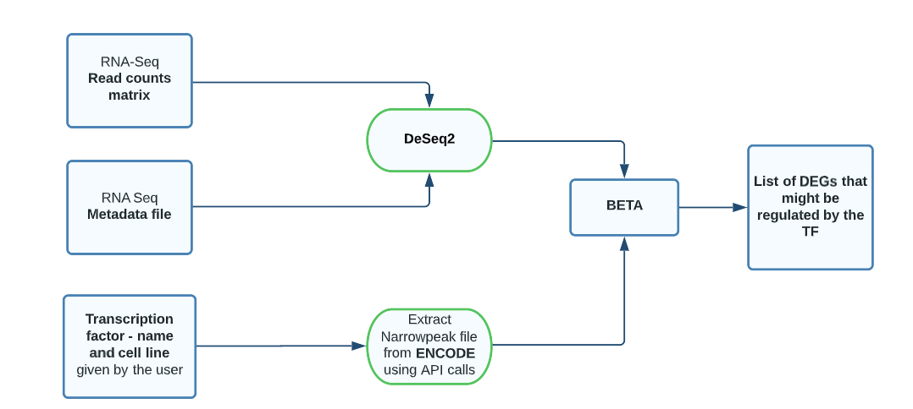

# RanCh
## Integrating RNA-Seq and ChIP-Seq to identify direct targets

RanCh allows the user to derive direct downstream targets for the desired transcription factor in the list of differentially expressed genes. 

- Input - 
          1.	Read counts matrix (.txt, .tsv or .csv)
          2.	Metadata file (.tsv)
          3.	Choosing the TF factor and cell line from the dropdown menu
- Output - a .txt file with the output from BETA. 
## About 

ChIP-Seq (chromatin immunoprecipitation sequencing) is a method to sequence the DNA fragments that co-precipitate with proteins. ChIP Seq assays have become an indispensable next generation technique for detecting in vivo interactions of DNA target sites against their corresponding transcription factors (TFs). RNA-Seq is mostly used to analyze quantitative difference in expression of the genes across various conditions.

The abundance of data pertaining to RNA-Seq and ChIP-Seq paves way for integration of these two sequencing technologies. Data from ChIP-Seq can strengthen data generated from RNA-Seq and helps researchers decipher the underlying gene regulation mechanisms, thereby enhancing our understanding of the genome. Consolidation of RNA-Seq and ChIP-Seq allows the detection of the most enriched transcription factor in the differentially expressed genes

> RanCh is novel, easy to use application to identify direct downstream > targets of differentially expressed genes. RanCh takes the counts matrix and metadata files (RNA-Seq) of an experiment as an input. The application allows the user to enter the transcription factor and cell line desired for integrative analysis. In the backend, the application uses the read counts to generate a list differentially expressed genes using DeSeq2. The app extracts the peak file of the desired TF and cell line from the ENCODE repository. As a final step, the list of DEGs and the peak file information is used by a tool named BETA. BETA finally gives a text output file (with a graphical output) which has the list of upregulated and downregulated target genes for the desired transcription factor. 

## Citations
1.	Wang, S., Sun, H., Ma, J., Zang, C., Wang, C., Wang, J., ... & Liu, X. S. (2013). Target analysis by integration of transcriptome and ChIP-seq data with BETA. Nature protocols, 8(12), 2502-2515.
2.	Love MI, Huber W, Anders S (2014). “Moderated estimation of fold change and dispersion for RNA-seq data with DESeq2.” Genome Biology, 15, 550. doi: 10.1186/s13059-014-0550-8